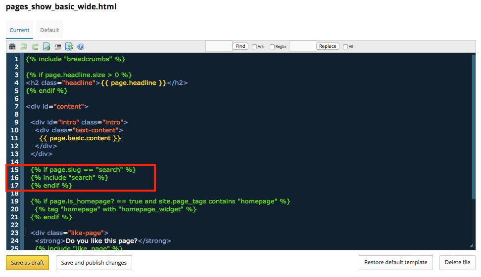

## Implementing Custom Search on your NationBuilder Website

We created this tutorial as a guest post on the NationBuilder community blog. You can see that post at the following link: [http://nationbuilder.com/implementing_a_custom_google_search_using_nationbuilder](http://nationbuilder.com/implementing_a_custom_google_search_using_nationbuilder).

In February 2017 [Google announced a series of changes to their custom search engine tools](https://customsearch.googleblog.com/2017/02/refocusing-and-looking-forward-on.html). As such, this tutorial has been updated to support Google's Custom Search Element V2 and to simplify the process of adding a custom search page to your NationBuilder site (it's now only 3 steps!).

### Steps to add search to your site

_Note: You’ll need to [create a custom theme](http://nationbuilder.com/theme_documentation#create_a_new_theme) if you don’t already have one._

1. Create a new “basic” page for your site. Call it what you want and place it as you please (the top nav is a hot option), but make sure the slug of the page is "search".

2. Add the partial called “[_search.html](_search.html)” to your custom theme:

    *   If you have [connected Dropbox to your nation](http://nationbuilder.com/how_to_sync_your_nation_s_themes_with_dropbox#connect), then you will upload that file via the nb_sync folder in your Dropbox account.

    *   Otherwise you can simply upload that file via the NationBuilder control panel (navigate to the relevant site, click the "theme" link, then choose "files" and add the partial using NationBuilder's simple drag and drop function).

3.  Add the following liquid snippet to your “pages_show_basic.html” and “pages_show_basic_wide.html” files, placing the code where you want the search bar and search results to appear (see an example in the screenshot below). Again, you will either update these files via Dropbox if you have conneted it your nation, otherwise you can edit them directly via the NationBuilder control panel:

    ```
    
    
    
    ```

    

This process will give you a brand-spanking new search page similar to the [Total Environment Centre](http://www.tec.org.au/search?q=Green+Energy), which includes the necessary search form and loads the results below. You can get more creative and add the search form wherever you wish across your site - just use <a href="" target="_blank">these lines of code</a> to include the form in other locations as you please. For example, Greens Parlimentarian Dawn Walker sports a custom search tool in the top nav of her [official site](http://www.dawnwalker.org.au/search?q=health).

### Styling your search page

The code provided in step 2 above will work on any website, however the classes provided are primarily intended for use with themes based on the Bootstrap framework (the industry-standard NationBuilder base theme since its release in 2015).

If your website uses a theme based on the "Aware" public theme, then you may find the code below more appropriate for your search form. Regardless of what theme your site uses, it is possible to apply styles via CSS to the search form and results to ensure they match your brand.

### Search form for sites using a version of the "Aware" public theme

```
<form method="get" action="/search">
	<input name="q" type="search" placeholder="Enter keywords..." style="display: inline-block; width: 200px; height: 40px; margin-bottom: 0;">
	<input type="submit" class="submit-button" style="height: 40px;" value="SEARCH">
</form> 
```

### Hiding pages from search

If you want to hide certain pages from search then you can add the following metatag to those pages, which will tell Google and other search providers to ignore the page when indexing your site (NationBuilder automatically adds this tag to "unlisted" pages):

`<meta name="robots" content="noindex">`

This code snippet belongs in the `<head>` section of your “layout.html”, but you’ll need to be careful to ensure that it's only added to the specific pages you wish to hide (a process which requires the use of [liquid conditionals](http://nationbuilder.com/liquid_basics#tags)):

### Wrap Up

This search function is just a mere foray into the world of useful navigational features. It could be used in conjunction with well-maintained archives, month/year filters, section categories and page tags.

Then again, you could always just eschew search, empty your archives and jettison your past in the fear it might [bite you on the ass](https://www.washingtonpost.com/news/worldviews/wp/2015/08/03/the-four-year-old-tweet-that-came-back-to-haunt-australias-prime-minister/).
